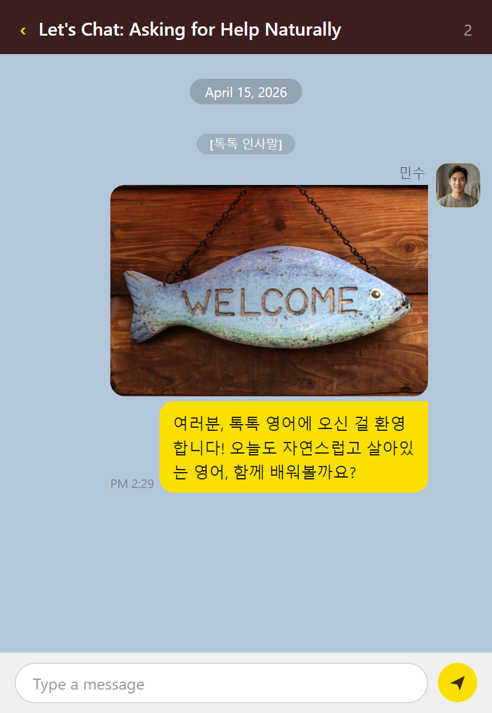
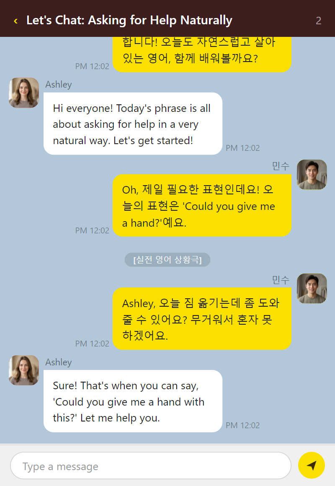

# PlayChat

[](https://www.npmjs.com/package/playchat)

[](https://github.com/doum1004/chat-in-video/actions/workflows/ci.yml)
[](./LICENSE)
[](https://bun.sh)
[](https://ko-fi.com/doum1004)

Converts a podcast episode JSON file into a themed chat-UI video (MP4). Audio
clips are sequenced by their measured durations and the final video is
frame-perfectly synced with the audio track.

## Installation

```bash
npm install -g playchat
```

Or run directly with `npx`:

```bash
npx playchat episode.json --record
```

## Requirements

- Node.js 18+
- ffmpeg + ffprobe in PATH

## Quick Start

```bash
# HTML preview (default theme: kakaotalk, files go to output/<timestamp>-<name>/)
npx playchat episode.json

# HTML preview to an explicit output folder
npx playchat episode.json --output ./my-output --theme imessage

# Record to MP4 (output goes to output/<timestamp>-<name>/)
npx playchat episode.json --record

# Record with explicit output folder, custom theme and pause
npx playchat episode.json --output ./my-output --record --theme kakaotalk --pause 4000
```

## CLI Options

```
npx playchat <input.json> [--output <dir>] [--record] [--record-full] [--segments] [--theme <id>] [--pause <ms>] [--no-avatar]
```

| Flag | Default | Description |
|---|---|---|
| `--output <dir>` | auto-generated | Output folder path |
| `--record` | _(off)_ | Produce an MP4 using static images (fast; one screenshot per dialogue) |
| `--record-full` | _(off)_ | Produce an MP4 using full frame-by-frame recording (slow; more CPU) |
| `--segments` | _(off)_ | Also produce individual MP4 videos per section (requires `--record` or `--record-full`) |
| `--theme <id>` | `kakaotalk` | Chat theme to render |
| `--pause <ms>` | `3000` | Silence between messages that have no audio file |
| `--no-avatar` | _(off)_ | Hide avatar circles and sender names |

## Output Directory

When `--output` is omitted, files are written to:

```
output/<YYYYMMDD-HHmmss>-<json-name>/
  output.html      ← rendered chat page (always)
  output.mp4       ← final video (with --record or --record-full)
  first_bubble.png ← first message bubble frame (with --record or --record-full)
  last_bubble.png  ← last message bubble frame (with --record or --record-full)
  manifest.json    ← run metadata and file list
```

Example: `output/20260414-143025-name/`

### Sample output (preview)

A full example render from [`fixtures/episode.json`](./fixtures/episode.json) is committed under [`fixtures/preview/`](./fixtures/preview/):

| File | Description |
|------|-------------|
| [`fixtures/preview/output.html`](./fixtures/preview/output.html) | Chat UI (open in a browser) |
| [`fixtures/preview/output.mp4`](./fixtures/preview/output.mp4) | Sample recording from `--record` (same episode) |
| [`fixtures/preview/first_bubble.png`](./fixtures/preview/first_bubble.png) | First message bubble frame from that recording |
| [`fixtures/preview/last_bubble.png`](./fixtures/preview/last_bubble.png) | Last message bubble frame from that recording |
| [`fixtures/preview/manifest.json`](./fixtures/preview/manifest.json) | Run metadata for that sample |

**Bubble still frames** (from the same sample `--record` run):





**Video preview** (recorded with `--record`, KakaoTalk theme):

<video src="https://raw.githubusercontent.com/doum1004/chat-in-video/main/fixtures/preview/output.mp4" controls muted playsinline width="400"></video>

**Hosted HTML preview** (layout and remote assets; no clone required):

[Open sample `output.html` →](https://htmlpreview.github.io/?https://raw.githubusercontent.com/doum1004/chat-in-video/main/fixtures/preview/output.html)

**Local preview** (best match to how the CLI writes files): clone the repo and open `fixtures/preview/output.html`, play `fixtures/preview/output.mp4`, or inspect `fixtures/preview/first_bubble.png` and `fixtures/preview/last_bubble.png`; or regenerate into that folder:

```bash
npx playchat fixtures/episode.json --output fixtures/preview --record
```

### manifest.json

Every run writes a `manifest.json` to the output folder:

```json
{
  "input": "/absolute/path/to/episode.json",
  "theme": "kakaotalk",
  "pauseMs": 3000,
  "showAvatar": true,
  "createdAt": "2026-04-14T20:57:14.123Z",
  "files": {
    "html": "output.html",
    "mp4": "output.mp4",
    "firstBubblePng": "first_bubble.png",
    "lastBubblePng": "last_bubble.png"
  },
  "dialogueCount": 5
}
```

`files.mp4`, `files.firstBubblePng`, and `files.lastBubblePng` are only present when `--record` or `--record-full` was used. All file paths are relative to the output folder.

## Available Themes

| Theme | ID | Viewport |
|---|---|---|
| KakaoTalk | `kakaotalk` | 400×580 |
| iMessage | `imessage` | 400×580 |

The first host in `episode.hosts` is treated as "me" and renders on the right
side; all other hosts render on the left. By default every message shows an
avatar circle and sender name. Pass `--no-avatar` to hide them.

## Episode JSON Format

```json
{
  "name": "...",
  "episode_title": "...",
  "episode_number": 1,
  "topic": "...",
  "subtitle": "...",
  "summary": "...",
  "hosts": [
    {
      "id": "host_1",
      "name": "Minsu",
      "image": "https://cdn.example.com/avatar_minsu.png",
      "gender": "male",
      "role": "main_host",
      "lang": "ko",
      "voice_config": { "voice_index": 0, "pitch": 0, "speed": 1.0 }
    }
  ],
  "sections": [
    {
      "section_id": 1,
      "section_title": "Opening",
      "section_type": "opening",
      "corner_name": "Opening 🎙️",
      "dialogues": [
        {
          "id": 1,
          "speaker": "host_1",
          "name": "Minsu",
          "text": "Hello!",
          "audio": "path/to/segment_0000.mp3"
        }
      ]
    }
  ]
}
```

`hosts[i].image` is optional. When present, the value is used as the avatar
image in chat themes; when omitted or if loading fails, the theme falls back to
the host's initial letter.

### Audio paths

The `audio` field on each dialogue accepts:

| Value | Behaviour |
|---|---|
| `""` (empty) | Message shown for `--pause` ms, then next message |
| `path/to/file.mp3` | Relative or absolute local path |
| `C:\absolute\path.mp3` | Windows absolute path |
| `https://cdn.example.com/a.mp3` | Remote URL (HTML preview only; not muxed into MP4) |

Local paths are resolved relative to the working directory and automatically
converted to `file:///` URIs in the rendered HTML.

## How Recording Works

```
episode.json
    │
    ├─ flattenDialogues()        normalise audio paths
    │
    ├─ buildTimeline()           ffprobe each audio file for exact duration
    │    showAtMs[0] = 0
    │    showAtMs[1] = dur[0] + 400ms gap
    │    showAtMs[N] = sum of previous (duration + gap), or pauseMs for no-audio
    │
    ├─ Puppeteer (scrubber mode)
    │    window.__TIMELINE__ injected before page load
    │    for each frame:
    │      page.evaluate("__SCRUB__(frameTimeMs)")  ← recorder is the clock
    │      page.screenshot()                        ← zero timing drift
    │
    ├─ ffmpeg: frames → silent MP4
    │
    ├─ buildAudioTrack()
    │    ffmpeg concat: [silence][clip0][silence][clip1]...
    │    gaps match the timeline exactly
    │
    └─ ffmpeg: mux silent MP4 + audio track → output.mp4
```

The browser never uses its own clock during recording. The recorder calls
`window.__SCRUB__(ms)` before every frame, passing the exact video timestamp
that frame represents. The browser renders whatever messages are due by that
time and no more — guaranteeing frame-perfect chat/audio sync regardless of
screenshot overhead.

The HTML file uses the normal live-audio mode for browser preview: audio
plays via `new Audio()` and the next message appears when `onended` fires.

## Docker

**Production (installs from npm):**
```bash
docker build -t playchat .
docker run --rm -v $(pwd)/input:/work/input -v $(pwd)/output:/work/output playchat \
  playchat input/episode.json
docker run --rm -v $(pwd)/input:/work/input -v $(pwd)/output:/work/output playchat \
  playchat input/episode.json --record --theme kakaotalk
```

## Development

### Project Structure

```
├── cli.ts               # CLI entry point (HTML preview + optional MP4 recording)
├── core/
│   ├── types.ts         # Interfaces, flattenDialogues(), normalizeAudioPath()
│   └── output.ts        # resolveOutputDir() — structured output folders
├── themes/
│   ├── base.ts          # Abstract BaseTheme (engine script, scrubber mode)
│   ├── kakaotalk.ts     # KakaoTalk theme
│   ├── imessage.ts      # iMessage theme
│   └── index.ts         # Theme registry + getTheme()
├── tests/
│   ├── flatten.test.ts  # Data layer + audio normalisation tests
│   ├── output.test.ts   # Output directory tests
│   └── themes.test.ts   # Theme contract + pauseMs tests
└── fixtures/
    ├── episode.json       # Full sample episode with real audio paths
    ├── episode_short.json # Shorter fixture for quick testing
    └── preview/            # Sample CLI output for README preview
        ├── output.html
        ├── output.mp4     # sample --record output (tracked despite root *.mp4)
        ├── first_bubble.png
        ├── last_bubble.png
        └── manifest.json
```

### Setup

```bash
git clone https://github.com/doum1004/playchat.git
cd chat-in-video
npm install
```

### Running from source

```bash
npx ts-node cli.ts episode.json --record
```

### Testing

```bash
npm test
```

### Adding a New Theme

1. Create `themes/yourtheme.ts`:

```typescript
import { BaseTheme, ThemeConfig } from "./base";

export class YourTheme extends BaseTheme {
  get id()       { return "yourtheme"; }
  get label()    { return "Your Theme"; }
  get viewport(): ThemeConfig { return { width: 440, height: 600 }; }

  render() { return this.wrapHTML(this.css, this.html, this.js); }

  private get css(): string { return `/* styles */`; }

  private get html(): string {
    return `
<div class="device">
  <div id="chat-body"></div>
</div>`;
  }

  private get js(): string {
    return `
const body = document.getElementById('chat-body');
function appendMsg(d) {
  // create and append one chat bubble for dialogue d
}
${this.engineScript}`;
  }
}
```

2. Register in `themes/index.ts`:

```typescript
import { YourTheme } from "./yourtheme";

const registry = {
  kakaotalk: KakaoTalkTheme,
  imessage:  IMessageTheme,
  yourtheme: YourTheme,        // ← add here
};
```

3. Use it:

```bash
npx playchat episode.json --theme yourtheme
npx playchat episode.json --theme yourtheme --record
```

### Theme contract

Every theme must satisfy three requirements in its JS block:

| Requirement | Why |
|---|---|
| Element `id="chat-body"` in HTML | Engine appends bubbles here |
| Function `appendMsg(d)` | Called once per dialogue — render one bubble |
| `${this.engineScript}` at the end of JS | Injects playback engine + scrubber mode |

`appendMsg(d)` receives a `FlatDialogue` object:

```typescript
{
  speaker:  string;  // "host_1", "host_2", ...
  name:     string;  // display name
  text:     string;  // message content
  audio:    string;  // file:/// URI or https:// URL (empty if none)
  audioRaw: string;  // original value from JSON
  section:  string;  // corner_name of the containing section
}
```

## License

MIT
